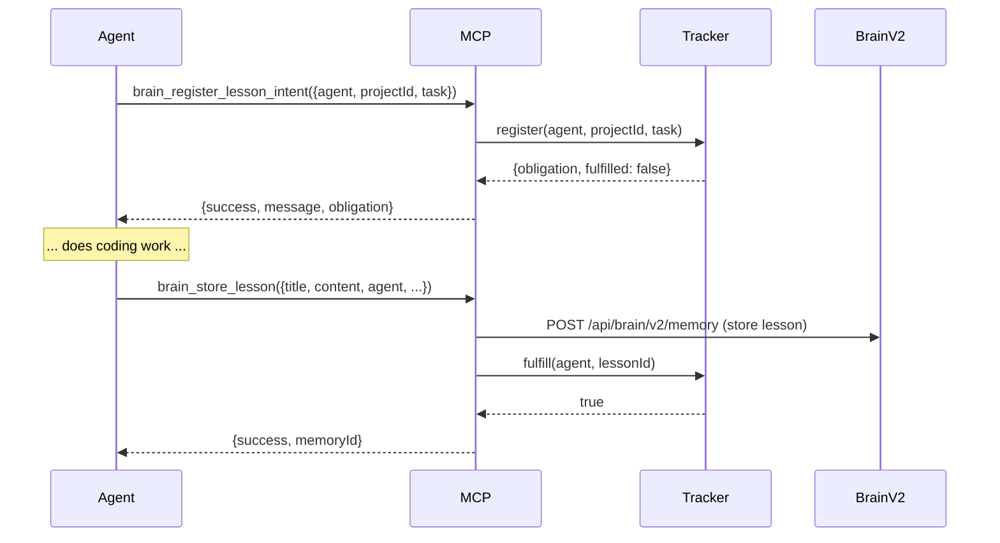

# AGENTS.md

This file provides guidance to agents when working with code in this repository.

## Superoo Agent Routing

Default orchestration flow:

1. Superoo retrieves relevant lessons from memory.
2. DeepSeek API compresses context (lessons, files, architecture, bugs, features, model decisions) into a compact task brief. Pre-computed lesson summaries from `memory/lesson-summaries.json` are injected directly — no re-compression needed.
3. Superoo builds compact task context.
4. DeepSeek is the default implementation coder.
5. Codex reviews architecture, safety, tests, and regressions.
6. New lessons are extracted after task completion.
7. DeepSeek API generates lesson summaries; Ollama generates embeddings for semantic search.
8. Central Brain stores the lesson permanently.

Important:

- Ollama is NOT the default coder.
- DeepSeek MCP is the mandatory coding worker for substantial implementation tasks.
- Codex is the planner/reviewer.
- Superoo orchestrates all models.

## Required Before Coding

Run:

```bash
node scripts/ml/build-agent-context.mjs "<task>"
```

Read:

```text
memory/context/latest-agent-context.md
```

## Required After Coding

Run:

```bash
node scripts/extract-lesson-from-commit.mjs --interactive
```

Or for batch backfill of historical commits:

```bash
node scripts/backfill-lessons.mjs --since YYYY-MM-DD
```

Optional if available:

```bash
node scripts/ollama-summarize-lesson.mjs
node scripts/central-brain-store-lesson.mjs
```

**Every completed task MUST produce a lesson** in `memory/lessons-learned.md` using the standard format:

```markdown
### Lesson: [Short descriptive title]

Date: [YYYY-MM-DD]
Source: [Agent name] task completion
Model/API used: [model]
Confidence: [high/medium/low]
Related files: [comma-separated list]

#### Task Summary

[What was accomplished?]

#### Files Changed

- [file1]
- [file2]

#### Bug Cause

[Root cause if applicable]

#### Fix Applied

[What fixed it?]

#### Test Result

[pass/fail/unknown]

#### Lesson Learned

[Reusable engineering insight]

#### Reusable Rule

[Specific actionable rule for future agents]

#### Tags

[tag1, tag2, tag3]

---
```

## Working Tree

The **Working Tree** ([`docs/resources/working-tree.md`](docs/resources/working-tree.md)) is the single source of truth for the SuperRoo product architecture. It documents all 18 core modules, their connections, product features, owners, and interaction flows.

**Before making any changes**, agents MUST read the Working Tree to:

- Understand which modules are affected and their connections
- Check the Feature Registry and Product Memory to avoid duplication
- Check the Bug Registry and Healing System for existing incidents
- Consider the CPU Guard and Parallel Execution Engine for resource management

The Working Tree is also visualized in the SuperRoo Cloud Dashboard under the **Working Tree** tab.

## Commit & Deploy Log

The **Commit & Deploy Log** ([`src/super-roo/product-memory/CommitDeployLog.ts`](src/super-roo/product-memory/CommitDeployLog.ts)) is THE single source of truth for all commits and deployments across all coding agents.

**ALL agents MUST follow these rules:**

1. **Record every commit**: After making code changes, call `CommitDeployLog.recordCommit()` with the commit SHA, agent name, type (feature/bugfix/refactor/docs/config/test/deploy/other), title, files changed, and features affected.

2. **Record every deploy**: When deploying, call `CommitDeployLog.recordDeploy()` with the version, commit SHA, and agent name. After the deploy completes, call `CommitDeployLog.updateDeployStatus()` with the result (healthy/unhealthy/rolled_back/failed).

3. **Check history first**: Before starting work, use `CommitDeployLog.getCommits()` and `CommitDeployLog.getDeploys()` with filters to see what other agents have done and avoid conflicts.

4. **Link to features**: Always include `featuresAffected` when recording commits so the Working Tree can track which features are being modified.

The log is append-only (no deletions, only status updates) and agent-aware (records which agent made the change). It is persisted as JSON at [`server/src/memory/commit-deploy-log.json`](server/src/memory/commit-deploy-log.json) and visualized in the dashboard Working Tree tab.

## Codex Task Memory

The persistent Codex task log lives at [`server/src/memory/codextask.json`](server/src/memory/codextask.json) and is exposed through the SuperRoo brain/MCP actions `codex_task_upsert`, `codex_task_list`, `codex_task_get`, and `codex_task_get_active`.

**Codex-style agents MUST follow these rules:**

1. Before starting work, call `codex_task_list` or `codex_task_get_active` so they can recover recent context.
2. When a task starts, call `codex_task_upsert` with `status: "active"`, a clear title, summary, and affected features when known.
3. When the task changes materially, update the same task ID instead of creating duplicates.
4. When the task ends, update it with `status: "completed"`, `"blocked"`, or `"cancelled"` and include the final summary, changed files, and affected features.

## Tailscale Deployment (Mandatory)

**ALL deployments — cloud, VS Code, Telegram, workers — MUST use Tailscale SSH.**

The VPS Tailscale IP is **`100.64.175.88`** (hostname: `ubuntu-s-2vcpu-4gb-amd-nyc1`). Never use the public IP (`104.248.225.250`) for SSH connections.

```bash
# Correct — Tailscale IP
SSH_TARGET="root@100.64.175.88"

# Wrong — public IP (do not use)
SSH_TARGET="root@104.248.225.250"
```

All deploy scripts and auto-deployers have been updated. See [`docs/super-roo/DEPLOYMENT_GUIDE.md`](docs/super-roo/DEPLOYMENT_GUIDE.md) for full details and the [`tailscale`](.roo/skills/tailscale/SKILL.md) skill for reference.

## Settings View Pattern

When working on `SettingsView`, inputs must bind to the local `cachedState`, NOT the live `useExtensionState()`. The `cachedState` acts as a buffer for user edits, isolating them from the `ContextProxy` source-of-truth until the user explicitly clicks "Save". Wiring inputs directly to the live state causes race conditions.

## Codex Workflow

This repository uses a model-routing workflow:

- **Codex** = planner, reviewer, tester, final verifier
- **DeepSeek MCP** = mandatory low-cost coder / refactor worker; DeepSeek API also handles context and lesson summaries
- **Ollama MCP** = local embeddings, memory learner, and retrieval helper
- **Central Brain** = persistent memory database / pgvector / lesson store

For Codex-led tasks, prefer this sequence:

1. Read repo rules and current context.
2. Check prior lessons and memory for related work.
3. Write the implementation plan.
4. Verify `node scripts/mcp-codex-bridge.mjs deepseek status` is healthy, then delegate the main coding work to DeepSeek MCP.
5. Review the result, run tests, and record lessons or updates.

If DeepSeek MCP is unavailable for a substantial coding task, fix the MCP/API connection first or mark the task blocked. Codex may only make minimal connectivity/configuration fixes needed to restore the DeepSeek route, or handle tiny non-implementation edits.

## Learning Layer Permanent Sync

**ALL agents are permanently synced to the SuperRoo learning layer.** This is not optional. The learning layer is the institutional memory of the project and prevents repeated mistakes.

### Before Coding — Retrieve Relevant Lessons

Agents MUST query the lesson index for relevant context:

```bash
# Get top lessons for the task at hand
node -e "const {getLessonRetriever} = require('./src/super-roo/lessons'); const retriever = getLessonRetriever(); retriever.load().then(() => retriever.getTopLessons(5)).then(lessons => console.log(JSON.stringify(lessons, null, 2)))"

# Query by file paths being modified
node -e "const {getLessonRetriever} = require('./src/super-roo/lessons'); const retriever = getLessonRetriever(); retriever.load().then(() => retriever.getLessonsForFile('src/super-roo/ml/engine/Tensor.ts', 3)).then(lessons => console.log(JSON.stringify(lessons, null, 2)))"

# Query by tags
node -e "const {getLessonRetriever} = require('./src/super-roo/lessons'); const retriever = getLessonRetriever(); retriever.load().then(() => retriever.getLessonsForTask('docker deployment', 5)).then(lessons => console.log(JSON.stringify(lessons, null, 2)))"
```

Agents SHOULD also:

- Search `memory/lessons-learned.md` for keywords related to the task
- Search `memory/bugs-fixed.md` for similar bugs
- Search `memory/feature-knowledge.md` for related features

### After Coding — Record Lessons

Agents MUST append a lesson to `memory/lessons-learned.md` and ensure it is indexed in `memory/lesson-index.jsonl`. The git `post-commit` hook auto-extracts templates, but agents MUST review and complete the TODO sections.

If a commit was not made (e.g., config fix, docs update), manually append the lesson.

### Automatic Lesson Capture Infrastructure

- **Post-commit hook** (`.husky/post-commit`): auto-runs `extract-lesson-from-commit.mjs` on every commit that matches lesson indicators (fix, bug, refactor, performance, etc.)
- **Backfill script** (`scripts/backfill-lessons.mjs`): batch-processes git history to extract missed lessons. Already backfilled 104 lessons from May 2026.
- **Lesson index** (`memory/lesson-index.jsonl`): machine-readable JSONL for programmatic retrieval
- **Lesson summaries** (`memory/lesson-summaries.json`): Ollama-generated embeddings and summaries
- **Sync script** ([`scripts/sync-lessons-to-central-brain.mjs`](scripts/sync-lessons-to-central-brain.mjs)): batch-pushes all locally-stored lessons to Central Brain with sync state tracking (`memory/.sync-state.json`). Supports `--dry-run`, `--status`, `--force` flags.
- **Retry queue** (`~/.superroo/retry-queue.json`): auto-queues failed MCP store operations with exponential backoff (2s base, doubles, capped at 60s, max 5 attempts). Processed via `superroo-learn retry`.
- **Systemd timer** ([`ops/superroo-sync-lessons.timer`](ops/superroo-sync-lessons.timer)): hourly VPS cron that runs the sync script and retry queue. Deploy with `sudo cp ops/superroo-sync-lessons.* /etc/systemd/system/ && sudo systemctl enable --now superroo-sync-lessons.timer`.

### Agent Sync Pledge

This agent (Kimi Code CLI) is permanently synced:

- ✅ Reads lessons before every substantial coding task
- ✅ Writes lessons after every task completion
- ✅ Uses the LessonRetriever API when available
- ✅ Contributes to `memory/lessons-learned.md` and `memory/lesson-index.jsonl`
- ✅ Runs backfill when new historical context is discovered
- ✅ Queues lessons for Central Brain sync when the API is online

Before substantial code changes, check or create:

- `memory/lessons-learned.md`
- `memory/bugs-fixed.md`
- `memory/model-decisions.md`
- `memory/feature-knowledge.md`
- `docs/updates/`
- `docs/architecture/`
- `product-features/feature-status.md`
- `commissioning/test-results.md`

Ask:

1. Have we solved a similar bug before?
2. What did the previous model get wrong?
3. What files are usually involved?
4. What test catches this issue?
5. What reusable rule should be enforced?

## Lesson Obligation Policy

**ALL coding agents MUST register a lesson intent before starting work and fulfill it after completing the task.** This policy ensures no agent completes work without contributing to the learning layer.

### How It Works

The Lesson Obligation System is implemented in the Central Brain MCP server ([`server/src/memory/McpMemoryServer.ts`](server/src/memory/McpMemoryServer.ts)) via the `LessonObligationTracker` class. It exposes three MCP tools:

| Tool | Purpose | When to Call |
|------|---------|-------------|
| `brain_register_lesson_intent` | Register intent to write a lesson | **Before** starting any substantial coding task |
| `brain_store_lesson` | Store a lesson in Central Brain v2 | **After** completing the task |
| `brain_lesson_status` | Check obligation status for an agent | Any time to verify compliance |

### Mandatory Rules

1. **Register before coding**: Call `brain_register_lesson_intent` with `{ agent, projectId, task }` before starting any substantial work. The MCP server tracks this as a pending obligation.

2. **Store lesson after coding**: Call `brain_store_lesson` with `{ title, content, agent, projectId, tags?, files?, summary?, confidence? }` after completing the task. This fulfills the obligation.

3. **Warn on pending**: The MCP server automatically warns agents with pending obligations when they connect. Agents MUST resolve warnings by either storing the lesson or explicitly marking it as fulfilled.

4. **Compliance check**: Use `brain_lesson_status` to verify compliance. The server returns per-agent status and aggregate stats.

### Workflow



### Stats & Monitoring

The system tracks:
- **Total obligations**: How many lessons were promised
- **Fulfilled**: How many were actually written
- **Pending**: How many are still outstanding

Use `brain_lesson_status` to get aggregate stats or per-agent status.

## Cross-Project Learning Layer

The SuperRoo learning layer now works across **any project**, not just this repo.

### Multi-Layer Fallback Architecture

The learning layer uses a **3-layer fallback strategy** to ensure lessons are never lost:

| Layer                     | Source                                   | Speed     | Network Required | When Used                                   |
| ------------------------- | ---------------------------------------- | --------- | ---------------- | ------------------------------------------- |
| **1 — Local JSONL**       | `memory/lesson-index.jsonl`              | ⚡ Fast   | No               | Default in superroo2 repo                   |
| **2 — Central Brain**     | MCP server (`http://127.0.0.1:3419/mcp`) | 🐢 Slower | Yes              | When local JSONL missing (cross-project)    |
| **3 — Markdown Fallback** | `memory/lessons-learned.md`              | ⚡ Fast   | No               | When JSONL + Central Brain both unavailable |

All three layers are transparent to callers — the system degrades gracefully.

### How It Works

| Component                | In superroo2 repo                       | In another project                        |
| ------------------------ | --------------------------------------- | ----------------------------------------- |
| **LessonRetriever**      | Layer 1 → Layer 3 (if no Central Brain) | Layer 2 → Layer 3 (if Central Brain down) |
| **PromptEnhancer**       | Injects local lessons (max 5)           | Injects cross-project lessons (max 10)    |
| **Git post-commit hook** | `.husky/post-commit` (repo-local)       | Global hook via `install-global-hook.mjs` |
| **CLI**                  | `node tools/superroo-learn.mjs`         | `superroo-learn` from any directory       |
| **Central Brain**        | Stores all lessons with project tags    | Same — all projects share the brain       |

### Fallback Details

#### LessonRetriever ([`src/super-roo/lessons/LessonRetriever.ts`](src/super-roo/lessons/LessonRetriever.ts))

1. **Layer 1**: Tries `memory/lesson-index.jsonl` (fastest, no network)
2. **Layer 2**: Tries Central Brain MCP with **retry logic** (2 retries, exponential backoff) and **health check** (3s timeout ping)
3. **Layer 3**: Parses `memory/lessons-learned.md` extracting `### Lesson:` blocks with title, date, tags, and summaries
4. If all layers fail, returns empty array (no crash)

#### PromptEnhancer ([`src/super-roo/lessons/PromptEnhancer.ts`](src/super-roo/lessons/PromptEnhancer.ts))

- **Local mode**: strict relevance threshold (0.8+), max 5 lessons
- **Remote mode**: broader threshold (0.6+), max 10 lessons
- **Markdown fallback mode**: neutral threshold (0.4+), max 8 lessons
- Lessons are annotated with source indicators (🌐 for remote, 📄 for markdown fallback)

#### superroo-learn CLI ([`tools/superroo-learn.mjs`](tools/superroo-learn.mjs))

- **Primary**: Central Brain MCP server
- **Fallback**: Local `memory/lesson-index.jsonl` or `memory/lessons-learned.md` in current/parent directories
- **Store fallback**: Appends to local `memory/lessons-learned.md` + `memory/lesson-index.jsonl`
- **Health check**: `superroo-learn health` command to diagnose connectivity
- **Disable**: Set `SUPERROO_NO_FALLBACK=1` to force Central Brain only

#### Global Post-Commit Hook ([`tools/global-post-commit`](tools/global-post-commit))

- Calls `superroo-learn extract-commit` which handles its own fallback
- If Central Brain is unreachable, lesson is stored locally in the repo's `memory/` directory
- Runs in background — `git commit` is never slowed down

#### extract-lesson-from-commit.mjs ([`scripts/extract-lesson-from-commit.mjs`](scripts/extract-lesson-from-commit.mjs))

- **Always** writes to local `memory/lessons-learned.md` + `memory/lesson-index.jsonl`
- **Best-effort** syncs to Central Brain via MCP (non-blocking, 5s timeout)
- Supports `--sync-central-brain` flag to batch-push all local lessons

### Installation (One-Time)

Run this once to enable cross-project learning:

```bash
# Install global git hook (auto-extracts lessons from ANY repo)
node tools/install-global-hook.mjs

# Add to PATH (optional, for superroo-learn from anywhere)
export PATH="$HOME/.superroo/bin:$PATH"
```

### Workflow for Any Project

**CRITICAL RULE: Every project MUST use `superroo-learn` to capture lessons.**

When coding in ANY project (not just superroo2), agents MUST ensure lessons are captured and stored in Central Brain. This is how cross-project learning works — lessons from project A become searchable from project B.

**Before coding in a new project:**

```bash
# 1. Install the global git hook (one-time per machine)
node tools/install-global-hook.mjs

# 2. Verify superroo-learn is accessible
superroo-learn health

# 3. Query lessons from ALL projects (including superroo2)
superroo-learn query "how to fix database connection leaks"

# Or query a specific project
superroo-learn query "deployment best practices" "superroo2"
```

**After coding in ANY project:**

```bash
# Store a lesson manually (auto-fallback to local if Central Brain is down)
superroo-learn store "React performance" "Disable strict mode in production to avoid double-rendering"

# Or just commit — the global hook auto-extracts lessons:
git commit -m "fix: resolved memory leak in WebSocket connection pool"
# Lesson is auto-stored in Central Brain (or locally if Central Brain is down)
# The lesson will include the project name (auto-detected from git remote)
```

**Verify cross-project tracking is working:**

```bash
# See which projects have contributed lessons
superroo-learn report

# Trace a topic across all projects
superroo-learn trace "deployment"

# Check if Central Brain is reachable
superroo-learn health
```

**Check status:**

```bash
superroo-learn status
superroo-learn health
superroo-learn projects
```

### Architecture

```
Any Project Directory
        │
        ├── git commit ──► global post-commit hook
        │                      │
        │                      ▼
        │              superroo-learn extract-commit
        │                 ┌────┴────┐
        │                 ▼         ▼
        │          Central Brain  Local files
        │          (primary)      (fallback)
        │                 │         │
        │                 ▼         ▼
        │            All projects can query all lessons
        │
        ├── coding session ──► LessonRetriever
        │                 ┌──────┴──────────┐
        │                 ▼                 ▼
        │          ┌─────────────┐   ┌───────────┐
        │          │ Layer 1     │   │ Layer 2   │
        │          │ Local JSONL │──►│ Central   │
        │          │ (fastest)   │   │ Brain MCP │
        │          └─────────────┘   └─────┬─────┘
        │                 │               │
        │                 ▼               ▼
        │          ┌─────────────┐   ┌───────────┐
        │          │ Layer 3     │   │ Retry x2  │
        │          │ Markdown    │◄──│ + Health  │
        │          │ Fallback    │   │ Check     │
        │          └─────────────┘   └───────────┘
        │                 │
        │                 ▼
        │           PromptEnhancer
        │          (source-aware)
        │                 │
        │                 ▼
        │       Injected into model prompt
        │       (with source indicators)
```

### Key Principles

1. **Local-first**: `LessonRetriever` prefers local files (faster, no network). Falls back to Central Brain only when local index is missing.
2. **Graceful degradation**: Every component has a fallback path. No single point of failure.
3. **Retry with backoff**: Central Brain calls retry up to 2 times with exponential backoff.
4. **Health-aware**: Components check Central Brain health before attempting calls.
5. **Project-tagged**: Every lesson is tagged with its source project. Queries can filter by project or search across all.
6. **Non-blocking**: The global git hook runs in the background. `git commit` is never slowed down.
7. **Zero-config for most projects**: Project name is auto-detected from `git remote`. Only override via `SUPERROO_PROJECT` env var if needed.
8. **No breaking changes**: All existing superroo2 code continues to work exactly as before. The new behavior is purely additive.
9. **Transparent fallback**: Callers don't need to know which layer is active. The system handles it automatically.

## Unified Deployment System (Mandatory)

**ALL AI coding agents (DeepSeek, Codex, Superoo, and any future agents) MUST use the unified deployment system for ALL deployments.** This prevents race conditions between multiple agents simultaneously deploying.

### Architecture

The unified deployment system consists of three components:

| Component | File | Purpose |
|-----------|------|---------|
| **DeployOrchestrator** | [`cloud/orchestrator/modules/DeployOrchestrator.js`](cloud/orchestrator/modules/DeployOrchestrator.js) | Single entry point for all deployments with queue, locking, health checks, and auto-rollback |
| **BuildQueue** | [`cloud/orchestrator/modules/BuildQueue.js`](cloud/orchestrator/modules/BuildQueue.js) | Project-scoped build queue with image deduplication and build result caching |
| **UnifiedBuilder** | [`cloud/orchestrator/modules/UnifiedBuilder.js`](cloud/orchestrator/modules/UnifiedBuilder.js) | Multi-type build system (Docker, Next.js, TypeScript, Static) |

### Mandatory Rules

1. **ALWAYS use `DeployOrchestrator.deploy()`** — Never deploy directly via SSH/SCP. Always go through the unified deploy method which handles queuing, locking, health checks, and rollback.

2. **ALWAYS use `BuildQueue.enqueueBuild()`** — Never run builds directly. Always go through the build queue which prevents duplicate builds and caches results.

3. **ALWAYS use `UnifiedBuilder.build()` or a type-specific builder** — Never run build commands directly. Use the auto-detection or explicit builder methods.

4. **ALWAYS record commits via `CommitDeployLog.recordCommit()`** — Every code change must be recorded before deployment.

5. **ALWAYS record deployments via `CommitDeployLog.recordDeploy()`** — Every deployment attempt (success, failure, rollback) must be logged.

6. **ALWAYS extract lessons after task completion** — Run `node scripts/extract-lesson-from-commit.mjs --interactive` or commit with a descriptive message to trigger the post-commit hook.

### API Endpoints

The unified deployment system exposes these API endpoints:

| Method | Endpoint | Description |
|--------|----------|-------------|
| POST | `/api/deploy` | Queue or execute a deployment |
| GET | `/api/deploy/queue` | Get deployment queue |
| GET | `/api/deploy/active` | Get active deployments |
| GET | `/api/deploy/builds` | Get build status |
| POST | `/api/deploy/cancel` | Cancel a deployment |
| POST | `/api/deploy/force` | Force a deployment (bypass queue) |

### Dashboard

The unified deployment system is visualized in the SuperRoo Cloud Dashboard under the **Deploy Orchestrator** tab.

### Global README Rule

**ALL SuperRoo AI agents MUST ensure every project's README is updated to document:**

1. **Deployer Agent** — How to use `DeployOrchestrator` for deployments
2. **Builder Agent** — How to use `UnifiedBuilder` for builds
3. **Commit & Learning Lessons** — How to use `CommitDeployLog` and the learning layer

This rule applies to ALL projects in the SuperRoo ecosystem. When working on a new project or making significant changes, agents MUST:

1. Check if the README documents the deployer agent, builder agent, and commit/learning workflow
2. If not, update the README to include these sections
3. Use the unified deployment system for all deployments
4. Record all commits and deployments
5. Extract and store lessons after every task

### Workflow

```

## MCP Workflow Enforcement (Mandated)

**ALL agents connecting to the SuperRoo Brain MCP server MUST follow the mandated workflow.** The MCP server enforces this via:

1. **`initialize` response `workflowRules` extension** — Every MCP client receives the mandated workflow rules during the initial handshake. The response includes `workflowRules.version`, `defaultCoder`, `defaultEmbeddings`, `defaultMemory`, `lessonObligation`, and a `rules` array with 6 rules (4 mandatory, 2 recommended).

2. **`brain_get_workflow_rules` tool** — Agents can retrieve the full ruleset at any time by calling this tool. Returns the same rules as the initialize response.

3. **`submit_task` workflow validation** — When calling `submit_task`, the server validates the `agent` parameter. If the agent is not `"deepseek-coder"` or `"deepseek"`, a `workflowWarnings` array is attached to the result warning about wf-001.

### Mandated Rules

| ID | Rule | Severity |
|----|------|----------|
| wf-001 | DeepSeek is the DEFAULT coder for all implementation tasks. Use the `deepseek-coder` MCP server for code generation, refactoring, and debugging. | mandatory |
| wf-002 | Ollama is the DEFAULT embeddings provider for semantic search, lesson summarization, and vector operations. Use the `ollama` MCP server for embeddings. | mandatory |
| wf-003 | Central Brain (pgvector) is the DEFAULT memory store for all persistent memory operations. Use `brain_search_memory` for semantic search. | mandatory |
| wf-004 | Every coding agent MUST contribute at least one lesson per session via `brain_store_lesson` or `brain_register_lesson_intent`. | mandatory |
| wf-005 | When submitting tasks via `submit_task`, the `agent` parameter should default to `"deepseek-coder"`. | recommended |
| wf-006 | Use `brain_search_memory` (pgvector semantic search) instead of `hermes_recall` for memory retrieval. | recommended |

### Client Implementation

MCP clients SHOULD:

1. Parse `workflowRules` from the `initialize` response and auto-configure their tooling (e.g., set DeepSeek as default coder, Ollama as default embeddings provider).
2. Call `brain_get_workflow_rules` at session start to confirm the mandated workflow.
3. Respect `workflowWarnings` returned by `submit_task` and adjust the agent parameter accordingly.
4. Register lesson intent via `brain_register_lesson_intent` before starting work and store the lesson via `brain_store_lesson` after completion.

### Compliance

The MCP server tracks compliance via the `LessonObligationTracker` (wf-004). Use `brain_lesson_status` to check per-agent compliance. Agents with pending obligations receive warnings on reconnection.
Agent wants to deploy
        │
        ▼
1. Commit code changes
2. Record commit via CommitDeployLog.recordCommit()
3. Call DeployOrchestrator.deploy({version, commitSha, agent})
        │
        ├── Active deploy? ──► Queued (auto-processed when active deploy completes)
        │
        ▼
4. Health check before deploy
        │
        ├── Unhealthy? ──► Abort with error
        │
        ▼
5. Build via UnifiedBuilder (if needed)
        │
        ├── Via BuildQueue (deduplication + caching)
        │
        ▼
6. Deploy to VPS via SSH/SCP
        │
        ▼
7. Health check after deploy
        │
        ├── Unhealthy? ──► Auto-rollback to last good version
        │
        ▼
8. Record deploy in CommitDeployLog
9. Extract lesson
10. Update README if needed
```
