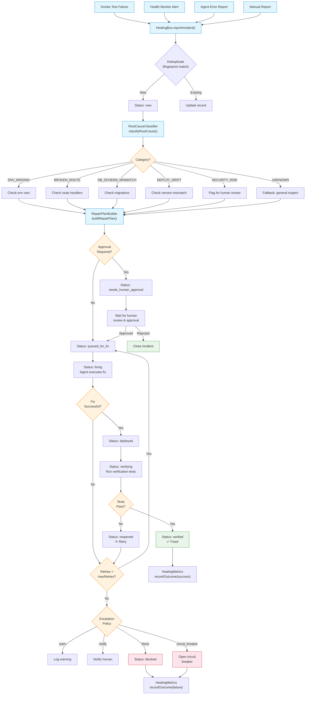
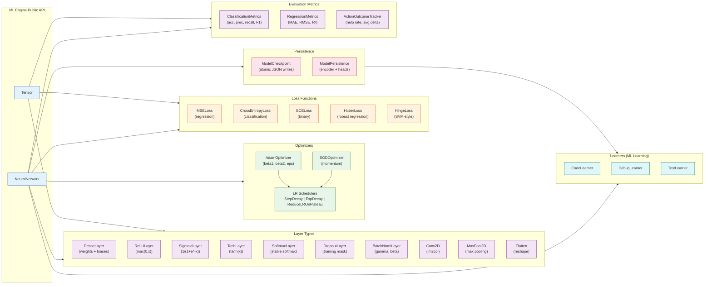
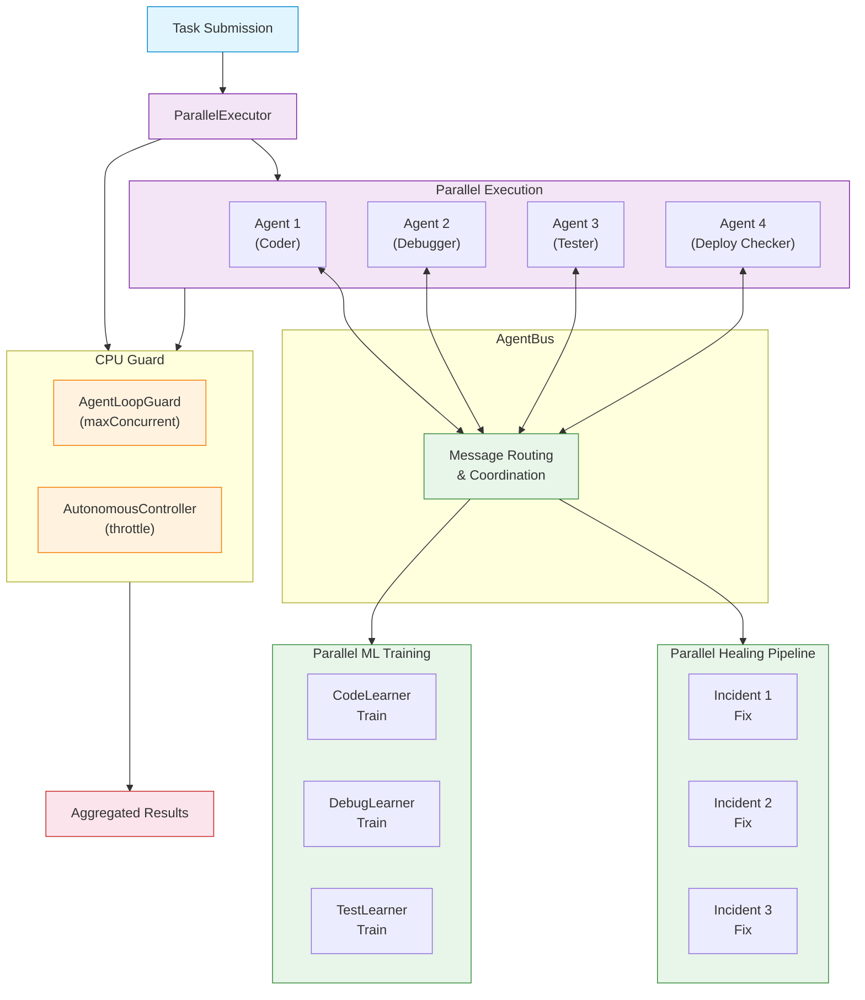
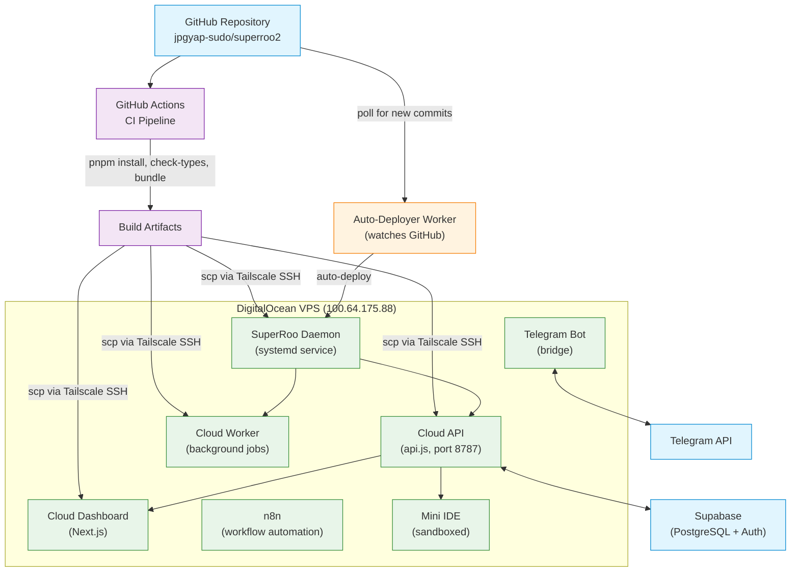

# SuperRoo Architecture Diagrams

> All diagrams use [Mermaid](https://mermaid.js.org/) syntax and render natively in GitHub-flavored Markdown.

---

## Table of Contents

1. [High-Level System Architecture](#1-high-level-system-architecture)
2. [Healing Module Flow](#2-healing-module-flow)
3. [ML Engine Component Diagram](#3-ml-engine-component-diagram)
4. [Log Aggregation & Monitoring Pipeline](#4-log-aggregation--monitoring-pipeline)
5. [Parallel Execution Engine](#5-parallel-execution-engine)
6. [Deployment Architecture](#6-deployment-architecture)

---

## 1. High-Level System Architecture

```
┌─────────────────────────────────────────────────────────────────────────┐
│                         VS Code Extension                                │
│  ┌───────────────────────────────────────────────────────────────────┐  │
│  │                    SuperRoo Orchestrator                           │  │
│  │  ┌──────────┐ ┌──────────┐ ┌──────────┐ ┌──────────┐ ┌────────┐  │  │
│  │  │ PM Agent │ │Coder Agent│ │Debugger  │ │ Tester   │ │Safety  │  │  │
│  │  │          │ │          │ │Agent     │ │ Agent    │ │Manager │  │  │
│  │  └──────────┘ └──────────┘ └──────────┘ └──────────┘ └────────┘  │  │
│  │                                                                     │  │
│  │  ┌──────────┐ ┌──────────┐ ┌──────────┐ ┌──────────────────────┐  │  │
│  │  │ Healing  │ │ ML Engine│ │ TaskQueue│ │ Product Memory       │  │  │
│  │  │ Module   │ │(Learners)│ │          │ │ (Features, Bugs)     │  │  │
│  │  └──────────┘ └──────────┘ └──────────┘ └──────────────────────┘  │  │
│  │                                                                     │  │
│  │  ┌──────────┐ ┌──────────┐ ┌──────────┐ ┌──────────────────────┐  │  │
│  │  │ CPU Guard│ │ Parallel │ │ Crawler  │ │ LogAggregator        │  │  │
│  │  │          │ │Executor  │ │ Agent    │ │ (buffered JSONL)     │  │  │
│  │  └──────────┘ └──────────┘ └──────────┘ └──────────────────────┘  │  │
│  └───────────────────────────────────────────────────────────────────┘  │
└─────────────────────────────────────────────────────────────────────────┘
                           │
                           ▼
┌─────────────────────────────────────────────────────────────────────────┐
│                         Cloud IDE (mini-ide)                             │
│  ┌───────────────────────────────────────────────────────────────────┐  │
│  │  Web Terminal │ File Browser │ Agent Runtime │ Sandbox Runner    │  │
│  └───────────────────────────────────────────────────────────────────┘  │
└─────────────────────────────────────────────────────────────────────────┘
                           │
                           ▼
┌─────────────────────────────────────────────────────────────────────────┐
│                         Cloud API (api.js)                               │
│  ┌──────────┐ ┌──────────┐ ┌──────────┐ ┌──────────┐ ┌──────────────┐  │
│  │ Telegram │ │ Auth     │ │Monitoring│ │ Healing  │ │ Savepoint    │  │
│  │ Bot      │ │ (JWT/OTP)│ │ Routes   │ │ Metrics  │ │ Service      │  │
│  └──────────┘ └──────────┘ └──────────┘ └──────────┘ └──────────────┘  │
└─────────────────────────────────────────────────────────────────────────┘
                           │
                           ▼
┌─────────────────────────────────────────────────────────────────────────┐
│                         Cloud Workers                                    │
│  ┌──────────────────┐ ┌──────────────────┐ ┌────────────────────────┐  │
│  │ Auto-Deployer    │ │ Debug Job Runner │ │ Sandbox Runner        │  │
│  │ (watches GitHub) │ │ (runs debug jobs)│ │ (isolated containers) │  │
│  └──────────────────┘ └──────────────────┘ └────────────────────────┘  │
└─────────────────────────────────────────────────────────────────────────┘
                           │
                           ▼
┌─────────────────────────────────────────────────────────────────────────┐
│                         External Services                                │
│  ┌──────────┐ ┌──────────┐ ┌──────────┐ ┌──────────┐ ┌──────────────┐  │
│  │ GitHub   │ │ Supabase │ │ Telegram │ │DigitalOcean│ │ n8n          │  │
│  │ (CI/CD)  │ │ (DB/Auth)│ │ (Bot API)│ │ (VPS)     │ │ (Workflows)  │  │
│  └──────────┘ └──────────┘ └──────────┘ └──────────┘ └──────────────┘  │
└─────────────────────────────────────────────────────────────────────────┘
```

### Component Responsibilities

| Layer                 | Components                               | Purpose                               |
| --------------------- | ---------------------------------------- | ------------------------------------- |
| **VS Code Extension** | Orchestrator, Agents, Healing, ML, Queue | Core automation engine                |
| **Cloud IDE**         | Mini-IDE, Sandbox                        | Browser-based development environment |
| **Cloud API**         | Telegram Bot, Auth, Monitoring           | REST API for external access          |
| **Cloud Workers**     | Auto-Deployer, Debug Runner              | Background task processing            |
| **External**          | GitHub, Supabase, Telegram, VPS          | Third-party integrations              |

---

## 2. Healing Module Flow



### Incident State Machine

```
                    ┌─────────────────────────────────────┐
                    │              new                     │
                    └──────────┬──────────────────────────┘
                               │
                               ▼
                    ┌─────────────────────────────────────┐
                    │         investigating                │
                    └──────────┬──────────────────────────┘
                               │
                               ▼
                    ┌─────────────────────────────────────┐
                    │        queued_for_fix                │
                    └──────┬──────────┬───────────────────┘
                           │          │
                           ▼          ▼
              ┌──────────────────┐  ┌──────────────────────────┐
              │     fixing       │  │  needs_human_approval    │
              └──────┬───────────┘  └──────────────────────────┘
                     │
                     ▼
              ┌──────────────────┐
              │    fix_ready     │
              └──────┬───────────┘
                     │
                     ▼
              ┌──────────────────┐
              │    deployed      │
              └──────┬───────────┘
                     │
                     ▼
              ┌──────────────────┐
              │   verifying      │
              └──────┬───────────┘
                     │
              ┌──────┴──────┐
              ▼             ▼
      ┌─────────────┐  ┌──────────┐
      │  verified   │  │ reopened │
      │  ✅ Done    │  │  ↻ Retry │
      └─────────────┘  └──────────┘
```

---

## 3. ML Engine Component Diagram



### Layer Architecture (Forward Pass)

```
Input Tensor [N, inFeatures]
        │
        ▼
┌───────────────────┐
│   DenseLayer      │  W: [inFeatures × outFeatures], b: [1 × outFeatures]
│   out = input·W+b │
└────────┬──────────┘
         │ [N, outFeatures]
         ▼
┌───────────────────┐
│  BatchNormLayer   │  γ, β learnable params
│  γ·(x-μ)/√(σ²+ε)+β│
└────────┬──────────┘
         │ [N, outFeatures]
         ▼
┌───────────────────┐
│   ReLULayer       │  max(0, x)
└────────┬──────────┘
         │ [N, outFeatures]
         ▼
┌───────────────────┐
│  DropoutLayer     │  (training only) random mask × 1/(1-rate)
└────────┬──────────┘
         │ [N, outFeatures]
         ▼
    (repeat for each hidden layer)
         │
         ▼
┌───────────────────┐
│  SoftmaxLayer     │  exp(x_i)/Σexp(x_j)
└────────┬──────────┘
         │ [N, outFeatures]
         ▼
   Output Tensor
```

### ConvNet Architecture (Image Classification)

```
Input [N, C×H×W]  e.g., [N, 3×32×32]
        │
        ▼
┌───────────────────────┐
│  Conv2D(3→16, 3×3)   │  im2col → matmul
│  ReLU                 │
│  MaxPool2D(2×2, S=2)  │  → [N, 16×16×16]
└──────────┬────────────┘
           │
           ▼
┌───────────────────────┐
│  Conv2D(16→32, 3×3)  │
│  ReLU                 │
│  MaxPool2D(2×2, S=2)  │  → [N, 32×8×8]
└──────────┬────────────┘
           │
           ▼
┌───────────────────────┐
│  Flatten              │  → [N, 2048]
│  Dense(2048→64)       │
│  ReLU                 │
│  Dense(64→10)         │
│  Softmax              │  → [N, 10]
└───────────────────────┘
```

---

## 4. Log Aggregation & Monitoring Pipeline

```mermaid
flowchart LR
    %% Sources
    EXT["VS Code Extension"]
    API["Cloud API"]
    WKR["Cloud Worker"]
    DASH["Dashboard"]
    HEAL["Healing Module"]
    ML["ML Engine"]

    %% LogAggregator
    EXT -->|"log(source, level, msg)"| LA["LogAggregator"]
    API --> LA
    WKR --> LA
    DASH --> LA
    HEAL --> LA
    ML --> LA

    subgraph BUFFER["In-Memory Buffer"]
        BUF["Buffer<LogEntry>\n(maxBufferSize: 100)"]
    end

    LA --> BUF

    subgraph FLUSH["Periodic Flush (every 5s)"]
        JSONL["JSONL File\nlogs/superroo-YYYY-MM-DD.jsonl"]
    end

    BUF -->|flush()| JSONL

    subgraph RETENTION["Retention Policy"]
        CLEANUP["Cleanup old files\n(retentionDays: 30)"]
    end

    JSONL --> CLEANUP

    %% Query
    subgraph QUERY["Query API"]
        Q["query(options)\nfilter: source, level, time, search"]
    end

    LA --> Q
    JSONL --> Q

    %% Monitoring Dashboard
    subgraph DASHBOARD["Cloud Dashboard"]
        MON["/api/monitoring/logs"]
        STATS["/api/monitoring/stats"]
        HEALTH["/api/monitoring/health-timeline"]
    end

    Q --> MON
    Q --> STATS
    Q --> HEALTH

    %% Styling
    classDef source fill:#e1f5fe,stroke:#0288d1
    classDef process fill:#f3e5f5,stroke:#7b1fa2
    classDef storage fill:#e8f5e9,stroke:#388e3c
    classDef query fill:#fff3e0,stroke:#f57c00
    classDef dash fill:#fce4ec,stroke:#c62828

    class EXT,API,WKR,DASH,HEAL,ML source
    class LA,BUF,FLUSH process
    class JSONL,CLEANUP storage
    class Q query
    class MON,STATS,HEALTH dash
```

### Log Entry Schema

```typescript
interface LogEntry {
	id: string // UUID v4
	timestamp: number // Unix ms
	source: LogSource // "extension" | "cloud-api" | "cloud-worker" | "dashboard" | "healing" | "ml" | "agent" | "system"
	level: LogLevel // "debug" | "info" | "warn" | "error" | "success"
	message: string // Human-readable
	metadata?: Record<string, unknown> // Structured data
}
```

### Query Examples

```typescript
// Get recent errors from healing module
const errors = await aggregator.query({
	source: "healing",
	level: "error",
	limit: 50,
})

// Get all logs in a time range
const range = await aggregator.query({
	from: Date.now() - 3600000, // Last hour
	to: Date.now(),
	search: "circuit breaker",
})

// Paginate through results
const page1 = await aggregator.query({ limit: 100, offset: 0 })
const page2 = await aggregator.query({ limit: 100, offset: 100 })
```

---

## 5. Parallel Execution Engine



---

## 6. Deployment Architecture



---

## See Also

- [`ML_ENGINE_API.md`](ML_ENGINE_API.md) — ML engine API reference
- [`HEALING_MODULE_GUIDE.md`](HEALING_MODULE_GUIDE.md) — Healing module usage guide
- [`TROUBLESHOOTING.md`](TROUBLESHOOTING.md) — Common issues and solutions
- [`DEPLOYMENT_GUIDE.md`](DEPLOYMENT_GUIDE.md) — Deployment instructions
- [`docs/resources/working-tree.md`](../resources/working-tree.md) — Product architecture working tree
