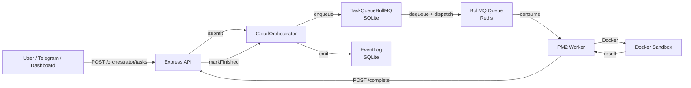
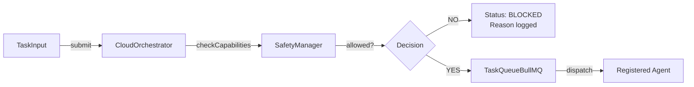
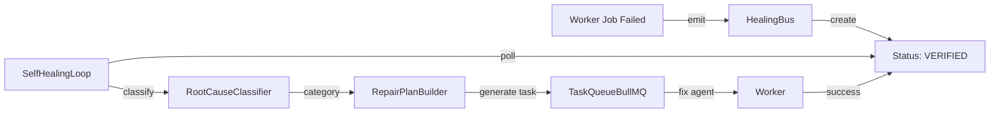
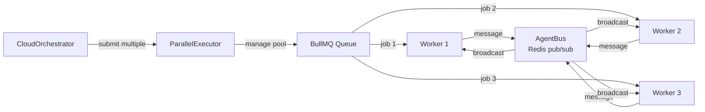

# Cloud Orchestrator Architecture Plan

> **Goal**: Bring the cloud orchestrator up to parity with the local VS Code [`SuperRooOrchestrator`](src/super-roo/orchestrator/SuperRooOrchestrator.ts:42).
>
> **Status**: Implementation in progress — Phase 1 (Core Shell) complete, enhancements deployed.

---

## Table of Contents

1. [Gap Analysis](#1-gap-analysis)
2. [Proposed Architecture](#2-proposed-architecture)
3. [Module Structure](#3-module-structure)
4. [Implementation Phases](#4-implementation-phases)
    - Phase 1: Core Shell + Event Log + Queue Bridge
    - Phase 2: Safety Manager + Agent Registry
    - Phase 3: Feature Registry + Bug Registry + Commit/Deploy Log
    - Phase 4: Self-Healing System
    - Phase 5: Parallel Execution + ML Loop
    - Phase 6: Full Parity + Dashboard Integration
5. [Deployment Strategy](#5-deployment-strategy)
6. [Appendix: Data Flow Diagrams](#6-appendix-data-flow-diagrams)

---

## 1. Gap Analysis

### 1.1 Local Orchestrator Capabilities

The local [`SuperRooOrchestrator`](src/super-roo/orchestrator/SuperRooOrchestrator.ts:42) owns 18 module connections:

| #   | Module                 | Local Implementation                                                                                                          | Cloud Equivalent                                                                 | Gap                                                              |
| --- | ---------------------- | ----------------------------------------------------------------------------------------------------------------------------- | -------------------------------------------------------------------------------- | ---------------------------------------------------------------- |
| 1   | **Orchestrator**       | [`SuperRooOrchestrator.ts`](src/super-roo/orchestrator/SuperRooOrchestrator.ts:42)                                            | LLM prompt in [`api.js:2622`](cloud/api/api.js:2622)                             | **MAJOR** — no lifecycle, no loop                                |
| 2   | **Agent System**       | [`AgentRegistry.ts`](src/super-roo/orchestrator/AgentRegistry.ts:12)                                                          | [`agent-runtime/agentRegistry.js`](cloud/agent-runtime/agentRegistry.js:31)      | **PARTIAL** — file-based registry, no runtime contract           |
| 3   | **Safety System**      | [`SafetyManager.ts`](src/super-roo/safety/SafetyManager.ts:62)                                                                | [`agent-runtime/safety.js`](cloud/agent-runtime/safety.js:14)                    | **MAJOR** — only command blocklist, no capability modes          |
| 4   | **Memory System**      | [`MemoryStore.ts`](src/super-roo/memory/MemoryStore.ts:1)                                                                     | None                                                                             | **MAJOR** — no SQLite persistence                                |
| 5   | **Task Queue**         | [`TaskQueue.ts`](src/super-roo/queue/TaskQueue.ts:79)                                                                         | BullMQ [`Queue`](cloud/api/api.js:290) in api.js                                 | **PARTIAL** — BullMQ has no priority semantics or task lifecycle |
| 6   | **Event Log**          | [`EventLog.ts`](src/super-roo/logging/EventLog.ts:32)                                                                         | JSONL logs + monitoring routes                                                   | **PARTIAL** — no append-only structured event stream             |
| 7   | **Feature Registry**   | [`FeatureRegistry.ts`](src/super-roo/features/FeatureRegistry.ts:1)                                                           | None                                                                             | **MAJOR** — no feature tracking                                  |
| 8   | **Bug Registry**       | [`BugRegistry.ts`](src/super-roo/bugs/BugRegistry.ts:1)                                                                       | None                                                                             | **MAJOR** — no bug tracking                                      |
| 9   | **Self-Healing**       | [`SelfHealingLoop.ts`](src/super-roo/healing/SelfHealingLoop.ts:1) + [`HealingBus.ts`](src/super-roo/healing/HealingBus.ts:1) | [`healing-metrics.js`](cloud/api/routes/healing-metrics.js:1) routes             | **PARTIAL** — read-only metrics, no active loop                  |
| 10  | **ML Engine**          | [`InfiniteImprovementLoop.ts`](src/super-roo/ml/loop/InfiniteImprovementLoop.ts:1)                                            | None                                                                             | **MAJOR** — no learning loop                                     |
| 11  | **Product Memory**     | [`ProductMemoryService`](src/super-roo/product-memory/)                                                                       | None                                                                             | **MAJOR** — no product memory                                    |
| 12  | **Commit/Deploy Log**  | [`CommitDeployLog.ts`](src/super-roo/product-memory/CommitDeployLog.ts:83)                                                    | JSON file [`commit-deploy-log.json`](server/src/memory/commit-deploy-log.json:1) | **PARTIAL** — file exists but not integrated into cloud flow     |
| 13  | **Debug Team**         | [`SuperDebugLoop.ts`](src/super-roo/debug-team/SuperDebugLoop.ts:1)                                                           | [`debugJobRunner.js`](cloud/worker/debugJobRunner.js:1)                          | **PARTIAL** — worker job only, no orchestration                  |
| 14  | **Parallel Execution** | [`ParallelExecutor.ts`](src/super-roo/parallel/ParallelExecutor.ts:1) + [`AgentBus.ts`](src/super-roo/parallel/AgentBus.ts:1) | None                                                                             | **MAJOR** — no parallel execution                                |
| 15  | **CPU Guard**          | [`AgentLoopGuard`](src/super-roo/cpu-guard/)                                                                                  | None                                                                             | **MAJOR** — no resource throttling                               |
| 16  | **Deploy System**      | [`DeployOrchestrator.ts`](src/super-roo/deploy/DeployOrchestrator.ts:1)                                                       | [`autoDeployer.js`](cloud/worker/autoDeployer.js:1)                              | **PARTIAL** — standalone auto-deployer only                      |
| 17  | **Crawler Agent**      | [`CrawlerAgent.ts`](src/super-roo/crawler/CrawlerAgent.ts:1)                                                                  | None                                                                             | **MAJOR** — no crawler                                           |
| 18  | **File Importer**      | [`FileImporter.ts`](src/super-roo/import/FileImporter.ts:1)                                                                   | None                                                                             | **MAJOR** — no file import                                       |

### 1.2 Cloud Orchestrator Current State

The existing cloud "orchestrator" is a single `@orchestrator` agent command inside [`api.js`](cloud/api/api.js:2622):

- **Input**: User message + workspace context
- **Process**: Builds a prompt, calls [`callChatCompletion()`](cloud/api/api.js:2671) via an AI provider
- **Output**: Text plan with `@mentions` and phase breakdown
- **State**: None — purely prompt-based, no persistence, no task lifecycle, no safety gates beyond the provider key check

### 1.3 Key Architectural Differences

| Aspect      | Local                                                               | Cloud                                                                      |
| ----------- | ------------------------------------------------------------------- | -------------------------------------------------------------------------- |
| Persistence | SQLite ([`better-sqlite3`](src/super-roo/memory/MemoryStore.ts:19)) | Redis (BullMQ) + JSON files                                                |
| Queue       | SQL-backed priority queue                                           | BullMQ FIFO                                                                |
| Agents      | In-process TS classes                                               | Docker sandbox + [`agentRunner.js`](cloud/agent-runtime/agentRunner.js:12) |
| Events      | SQLite + live subscribers                                           | JSONL files + HTTP polling                                                 |
| Safety      | Capability-mode matrix + blocklist                                  | Command string blocklist only                                              |
| ML          | In-process neural loop                                              | None                                                                       |
| Healing     | Active loop + bus                                                   | Passive JSON routes                                                        |

---

## 2. Proposed Architecture

### 2.1 Design Principles

1. **Incremental value** — each phase adds deployable, testable functionality.
2. **Preserve existing infrastructure** — BullMQ, Express API, PM2 workers, Docker sandbox remain untouched at their core.
3. **Queue Bridge Pattern** — the CloudOrchestrator maintains its own SQLite task state; BullMQ is used only for the final worker dispatch layer.
4. **Headless reuse** — port local TS modules to JS in `cloud/orchestrator/`; keep them free of VS Code dependencies.
5. **Tailscale-only** — all internal VPS communication uses `100.64.175.88`.
6. **CommitDeployLog discipline** — every phase deployment is recorded.

### 2.2 High-Level Design

```
┌─────────────────────────────────────────────────────────────────────┐
│                        CloudOrchestrator.js                         │
│  (Equivalent to SuperRooOrchestrator.ts)                            │
│                                                                     │
│  ┌─────────────┐  ┌─────────────┐  ┌─────────────┐  ┌───────────┐ │
│  │ MemoryStore │  │  EventLog   │  │ SafetyMgr   │  │AgentRegistry││
│  │  (SQLite)   │  │ (SQLite+    │  │ (capability │  │ (wraps    │ │
│  │             │  │  pub/sub)   │  │  modes)     │  │ existing) │ │
│  └──────┬──────┘  └──────┬──────┘  └──────┬──────┘  └─────┬─────┘ │
│         │                │                │               │       │
│  ┌──────┴────────────────┴────────────────┴───────────────┴─────┐ │
│  │                      TaskQueueBullMQ.js                        │ │
│  │   SQLite task lifecycle  →  BullMQ dispatch  →  Worker       │ │
│  │   (priority, status, retry, followups)                        │ │
│  └──────────────────────────────────────────────────────────────┘ │
│         │                                                          │
│  ┌──────┴────────────────────────────────────────────────────────┐ │
│  │                    FeatureRegistry + BugRegistry               │ │
│  │                    CommitDeployLog                             │ │
│  └────────────────────────────────────────────────────────────────┘ │
│         │                                                          │
│  ┌──────┴────────────────────────────────────────────────────────┐ │
│  │              SelfHealingLoop + HealingBus + ML Loop            │ │
│  │              ParallelExecutor + AgentBus                       │ │
│  └────────────────────────────────────────────────────────────────┘ │
└─────────────────────────────────────────────────────────────────────┘
                              │
                              ▼
┌─────────────────────────────────────────────────────────────────────┐
│                         Express API (api.js)                        │
│  New routes under /orchestrator/*, /tasks/*, /features/*, /bugs/*   │
│  Existing routes remain backward-compatible                         │
└─────────────────────────────────────────────────────────────────────┘
                              │
                              ▼
┌─────────────────────────────────────────────────────────────────────┐
│                    BullMQ Queue (Redis)                             │
│  Existing superroo-jobs queue — no schema changes                   │
└─────────────────────────────────────────────────────────────────────┘
                              │
                              ▼
┌─────────────────────────────────────────────────────────────────────┐
│                    PM2 Worker (worker.js)                           │
│  Existing Docker sandbox execution — no changes needed              │
└─────────────────────────────────────────────────────────────────────┘
```

### 2.3 Communication Contract

The CloudOrchestrator will expose an internal API surface that `api.js` routes call into. This keeps the orchestrator decoupled from HTTP concerns:

```javascript
// cloud/orchestrator/CloudOrchestrator.js — public interface
class CloudOrchestrator {
  async start()                      // initialize SQLite, start loops
  async stop()                       // graceful shutdown
  submit(input) -> Task             // enqueue a task
  processNext() -> ProcessResult    // single-step (for testing)
  runLoop(opts) -> Promise<void>    // continuous loop
  setMode(mode)                     // OFF / SAFE / AUTO / FULL_AUTONOMOUS
  registerAgent(agent)              // add an agent
  // ... plus registry APIs for features, bugs, incidents, commits, deploys
}
```

---

## 3. Module Structure

### 3.1 New Directory: `cloud/orchestrator/`

```
cloud/orchestrator/
├── CloudOrchestrator.js          # Main class — lifecycle, loop, dispatch
├── TelegramOrchestratorBridge.js # Bridge between Telegram bot and orchestrator
├── stores/
│   ├── MemoryStore.js            # SQLite wrapper (port of MemoryStore.ts)
│   ├── schema.sql                # Unified schema: tasks, features, bugs, events, incidents
│   └── migrations/               # Schema migrations (append-only)
│       └── 001_add_worker_id.sql # Atomic task claim support
├── modules/
│   ├── EventLog.js               # Append-only events (SQLite + Redis pub/sub fallback)
│   ├── TaskQueueBullMQ.js        # Priority queue with BullMQ bridge
│   ├── SafetyManager.js          # Capability-mode matrix + blocklist
│   ├── AgentRegistry.js          # Wraps agent-runtime/agentRegistry.js
│   ├── FeatureRegistry.js        # Feature lifecycle tracking
│   ├── BugRegistry.js            # Bug tracking
│   ├── CommitDeployLog.js        # Audit trail (writes to server/src/memory/)
│   ├── HealingBus.js             # Incident coordination
│   ├── SelfHealingLoop.js        # Detect → classify → plan → fix → verify
│   ├── ParallelExecutor.js       # Concurrency control
│   ├── AgentBus.js               # Inter-agent messaging
│   ├── ContextAssembler.js       # Task context enrichment (FeatureRegistry + EventLog + LearningGateway + file tree)
│   ├── HermesClaw.js             # Memory & context agent (Ollama/OpenAI/DeepSeek)
│   ├── LearningGateway.js        # Lesson search, store, curation, scoring
│   └── TaskExecutor.js           # 7-step task execution pipeline
├── config/
│   └── blocklist.json            # Safety blocklist (shared format with local)
└── index.js                      # Public exports
```

### 3.2 Files to Modify

| File                                                                                     | Change                                                                                                                                                                             |
| ---------------------------------------------------------------------------------------- | ---------------------------------------------------------------------------------------------------------------------------------------------------------------------------------- |
| [`cloud/api/api.js`](cloud/api/api.js:1)                                                 | Add `/orchestrator/*`, `/tasks/*`, `/features/*`, `/bugs/*`, `/healing/*` routes. Keep existing routes intact. Replace `@orchestrator` agent body with CloudOrchestrator.submit(). |
| [`cloud/ecosystem.config.js`](cloud/ecosystem.config.js:1)                               | Add `SUPERROO_DB_PATH` env var. Ensure `superroo-api` has access to SQLite file.                                                                                                   |
| [`cloud/worker/worker.js`](cloud/worker/worker.js:1)                                     | Minor: emit job completion events back to orchestrator via internal HTTP POST or Redis pub/sub.                                                                                    |
| [`server/src/memory/commit-deploy-log.json`](server/src/memory/commit-deploy-log.json:1) | Updated by CommitDeployLog.js after each phase deploy.                                                                                                                             |

---

## 4. Implementation Phases

### Phase 1: Core Shell + Event Log + Queue Bridge

**Objective**: The CloudOrchestrator exists as a real service. Tasks submitted via API have a full lifecycle (pending → running → succeeded/failed/blocked) and are logged.

**New files**:

- [`cloud/orchestrator/CloudOrchestrator.js`](cloud/orchestrator/CloudOrchestrator.js)
- [`cloud/orchestrator/stores/MemoryStore.js`](cloud/orchestrator/stores/MemoryStore.js)
- [`cloud/orchestrator/stores/schema.sql`](cloud/orchestrator/stores/schema.sql)
- [`cloud/orchestrator/modules/EventLog.js`](cloud/orchestrator/modules/EventLog.js)
- [`cloud/orchestrator/modules/TaskQueueBullMQ.js`](cloud/orchestrator/modules/TaskQueueBullMQ.js)
- [`cloud/orchestrator/index.js`](cloud/orchestrator/index.js)

**Modified files**:

- [`cloud/api/api.js`](cloud/api/api.js:1) — add routes:
    - `POST /orchestrator/tasks` — submit task
    - `GET  /orchestrator/tasks/:id` — get task
    - `GET  /orchestrator/tasks` — list tasks (paginated)
    - `POST /orchestrator/tasks/:id/cancel` — cancel task
    - `GET  /orchestrator/events` — query events
- [`cloud/ecosystem.config.js`](cloud/ecosystem.config.js:1) — add `SUPERROO_DB_PATH=/opt/superroo2/cloud/data/orchestrator.db`

**Queue Bridge design**:

1. `TaskQueueBullMQ.enqueue()` inserts into SQLite with status `pending`.
2. `TaskQueueBullMQ.dequeue()` atomically selects highest-priority pending task, sets `running`, then adds a BullMQ job.
3. Worker completes BullMQ job → worker calls `POST http://100.64.175.88:8787/orchestrator/tasks/:id/complete` with result.
4. Orchestrator updates SQLite status to `succeeded`/`failed` and emits event.

**Exit criteria**:

- [x] `POST /orchestrator/tasks` returns a task ID.
- [x] Task progresses through `pending → running → succeeded` in SQLite.
- [x] Events appear in `GET /orchestrator/events`.
- [x] Existing `/job` endpoint still works (backward compatibility).
- [ ] [`CommitDeployLog`](src/super-roo/product-memory/CommitDeployLog.ts:83) records this phase's deployment.

---

### Phase 2: Safety Manager + Agent Registry

**Objective**: Tasks are gated by capability-based safety modes. Agents are registered with required capabilities. Unknown or unsafe tasks are blocked with a reason.

**New files**:

- [`cloud/orchestrator/modules/SafetyManager.js`](cloud/orchestrator/modules/SafetyManager.js)
- [`cloud/orchestrator/modules/AgentRegistry.js`](cloud/orchestrator/modules/AgentRegistry.js)
- [`cloud/orchestrator/config/blocklist.json`](cloud/orchestrator/config/blocklist.json)

**Modified files**:

- [`cloud/api/api.js`](cloud/api/api.js:1) — add routes:
    - `GET  /orchestrator/safety/mode`
    - `POST /orchestrator/safety/mode`
    - `GET  /orchestrator/agents`
    - `POST /orchestrator/agents/:name/register`
- Replace the `@orchestrator` prompt-based handler with a real `CloudOrchestrator.submit()` call that passes through SafetyManager.

**SafetyManager port**:

- Port [`SafetyManager.ts`](src/super-roo/safety/SafetyManager.ts:62) to JS.
- Support modes: `OFF`, `SAFE`, `AUTO`, `FULL_AUTONOMOUS`.
- Load [`blocklist.json`](cloud/orchestrator/config/blocklist.json) (same schema as local).
- Gate task submission and dispatch.

**AgentRegistry design**:

- Wrap the existing [`agent-runtime/agentRegistry.js`](cloud/agent-runtime/agentRegistry.js:31) (file-based agent list).
- Add runtime capability declarations per agent.
- Validate that a task's `agent` field matches a registered agent before dispatch.

**Exit criteria**:

- [ ] Setting mode to `OFF` blocks all new tasks.
- [ ] A task requiring `write.file` is blocked in `SAFE` mode.
- [ ] A task with unknown agent returns `blocked` with clear reason.
- [ ] Existing agent jobs via `/job` still execute (they bypass orchestrator safety for backward compat, or are migrated).
- [ ] [`CommitDeployLog`](src/super-roo/product-memory/CommitDeployLog.ts:83) records this phase's deployment.

---

### Phase 3: Feature Registry + Bug Registry + Commit/Deploy Log

**Objective**: Cloud has product memory. Features and bugs are tracked in SQLite. Every commit and deploy is recorded in the shared log.

**New files**:

- [`cloud/orchestrator/modules/FeatureRegistry.js`](cloud/orchestrator/modules/FeatureRegistry.js)
- [`cloud/orchestrator/modules/BugRegistry.js`](cloud/orchestrator/modules/BugRegistry.js)
- [`cloud/orchestrator/modules/CommitDeployLog.js`](cloud/orchestrator/modules/CommitDeployLog.js)

**Modified files**:

- [`cloud/api/api.js`](cloud/api/api.js:1) — add routes:
    - `GET|POST /orchestrator/features`
    - `GET|POST /orchestrator/bugs`
    - `GET|POST /orchestrator/commits`
    - `GET|POST /orchestrator/deploys`
- [`server/src/memory/commit-deploy-log.json`](server/src/memory/commit-deploy-log.json:1) — schema already compatible; CloudOrchestrator writes to it.

**Exit criteria**:

- [ ] `POST /orchestrator/features` creates a feature; `GET` lists it with status.
- [ ] `POST /orchestrator/bugs` creates a bug linked to a feature.
- [ ] A deploy via the API calls `CommitDeployLog.recordDeploy()`.
- [ ] Dashboard can read commits/deploys from the same JSON file.
- [ ] [`CommitDeployLog`](src/super-roo/product-memory/CommitDeployLog.ts:83) records this phase's deployment.

---

### Phase 4: Self-Healing System

**Objective**: The cloud actively detects incidents from worker failures, classifies root causes, and runs repair plans.

**New files**:

- [`cloud/orchestrator/modules/HealingBus.js`](cloud/orchestrator/modules/HealingBus.js)
- [`cloud/orchestrator/modules/SelfHealingLoop.js`](cloud/orchestrator/modules/SelfHealingLoop.js)
- [`cloud/orchestrator/modules/RootCauseClassifier.js`](cloud/orchestrator/modules/RootCauseClassifier.js) (port)
- [`cloud/orchestrator/modules/RepairPlanBuilder.js`](cloud/orchestrator/modules/RepairPlanBuilder.js) (port)

**Modified files**:

- [`cloud/api/api.js`](cloud/api/api.js:1) — add routes:
    - `GET  /orchestrator/healing/incidents`
    - `POST /orchestrator/healing/incidents`
    - `POST /orchestrator/healing/incidents/:id/approve`
- [`cloud/worker/worker.js`](cloud/worker/worker.js:1) — on job failure, emit incident to orchestrator.
- [`cloud/api/routes/healing-metrics.js`](cloud/api/routes/healing-metrics.js:1) — redirect to read from orchestrator SQLite instead of JSON files.

**Healing Loop design**:

- [`SelfHealingLoop.js`](cloud/orchestrator/modules/SelfHealingLoop.js) polls SQLite for open incidents.
- Classifies root cause using pattern matching (port from local).
- Generates a repair plan (a task) and submits it to the TaskQueue.
- Auto-fix policies: `low=true`, `medium=false`, `high=false`, `critical=false` (configurable).

**Exit criteria**:

- [ ] A failed worker job creates an incident record.
- [ ] Incident status advances through `new → investigating → queued_for_fix → fixing → verified`.
- [ ] Dashboard `/api/healing/incidents` returns orchestrator data.
- [ ] [`CommitDeployLog`](src/super-roo/product-memory/CommitDeployLog.ts:83) records this phase's deployment.

---

### Phase 5: Parallel Execution + ML Loop

**Objective**: Multiple agents can run in parallel. The system learns from task history to improve routing and prompts.

**New files**:

- [`cloud/orchestrator/modules/ParallelExecutor.js`](cloud/orchestrator/modules/ParallelExecutor.js)
- [`cloud/orchestrator/modules/AgentBus.js`](cloud/orchestrator/modules/AgentBus.js)
- [`cloud/orchestrator/modules/ParallelHealingPipeline.js`](cloud/orchestrator/modules/ParallelHealingPipeline.js)
- [`cloud/orchestrator/modules/ParallelMLTrainer.js`](cloud/orchestrator/modules/ParallelMLTrainer.js)
- [`cloud/orchestrator/modules/InfiniteImprovementLoop.js`](cloud/orchestrator/modules/InfiniteImprovementLoop.js)

**Modified files**:

- [`cloud/api/api.js`](cloud/api/api.js:1) — add route:
    - `GET /orchestrator/stats` — shows parallel execution stats, ML training status
- [`cloud/worker/worker.js`](cloud/worker/worker.js:1) — increase `CONCURRENCY` env default to `4`.

**ParallelExecutor design**:

- Manages a concurrency pool (default 4) backed by BullMQ worker slots.
- Enforces token budget and task timeout.
- Uses `AgentBus` for inter-agent messaging via Redis pub/sub.

**ML Loop design**:

- Port [`InfiniteImprovementLoop.ts`](src/super-roo/ml/loop/InfiniteImprovementLoop.ts:1) to JS.
- Reads completed task history from SQLite.
- Trains learners (CodeLearner, DebugLearner, TestLearner) on cloud task data.
- Updates agent prompt templates or routing weights.

**Exit criteria**:

- [ ] 4 tasks can run simultaneously via BullMQ workers.
- [ ] AgentBus messages pass between concurrent tasks.
- [ ] ML loop reads task history and produces a model update.
- [ ] [`CommitDeployLog`](src/super-roo/product-memory/CommitDeployLog.ts:83) records this phase's deployment.

---

### Phase 6: Full Parity + Dashboard Integration

**Objective**: The cloud orchestrator is functionally equivalent to the local one. The dashboard Working Tree tab shows cloud state.

**New files**:

- [`cloud/orchestrator/modules/CrawlerAgent.js`](cloud/orchestrator/modules/CrawlerAgent.js) (port)
- [`cloud/orchestrator/modules/DeployOrchestrator.js`](cloud/orchestrator/modules/DeployOrchestrator.js) (port)
- [`cloud/orchestrator/modules/FileImporter.js`](cloud/orchestrator/modules/FileImporter.js) (port)
- [`cloud/orchestrator/modules/CPUGuard.js`](cloud/orchestrator/modules/CPUGuard.js) (port)

**Modified files**:

- [`cloud/api/api.js`](cloud/api/api.js:1) — consolidate all orchestrator routes; add `/orchestrator/status` for health.
- [`cloud/dashboard/src/components/views/working-tree.tsx`](cloud/dashboard/src/components/views/working-tree.tsx:1) — connect to cloud orchestrator REST API instead of static data.
- [`cloud/ecosystem.config.js`](cloud/ecosystem.config.js:1) — add `superroo-orchestrator` PM2 app (optional split from api).

**Exit criteria**:

- [ ] Every module in [`working-tree.md`](docs/resources/working-tree.md:1) has a cloud counterpart.
- [ ] Dashboard Working Tree tab displays real cloud module status.
- [ ] `CloudOrchestrator` API surface matches `SuperRooOrchestrator` semantics.
- [ ] All existing Telegram bot, dashboard, and API functionality remains operational.
- [ ] [`CommitDeployLog`](src/super-roo/product-memory/CommitDeployLog.ts:83) records this phase's deployment.

---

## 4b. Enhancements Deployed (May 2026)

The following enhancements have been implemented beyond the original Phase 1 scope:

### Enhancement 1: Atomic Task Claim (`claimNext`)

**Files**: [`cloud/orchestrator/modules/TaskQueueBullMQ.js`](cloud/orchestrator/modules/TaskQueueBullMQ.js:254), [`cloud/orchestrator/stores/migrations/001_add_worker_id.sql`](cloud/orchestrator/stores/migrations/001_add_worker_id.sql:1)

Replaces the two-statement `nextPending()` + `update(running)` pattern with a single atomic `UPDATE ... RETURNING *` SQLite statement. This prevents race conditions when multiple orchestrator instances compete for the same pending task.

- New method: `claimNext(workerId, typeFilter?)` — atomically claims the highest-priority pending task
- Migration system: [`MemoryStore._applyMigrations()`](cloud/orchestrator/stores/MemoryStore.js:63) reads numbered SQL files from `stores/migrations/`, applies unapplied ones sequentially
- Migration `001_add_worker_id.sql`: adds `worker_id TEXT` column + index to the `tasks` table
- Tests: 11 tests in [`cloud/test/task-queue-atomic.test.js`](cloud/test/task-queue-atomic.test.js) covering basic claim, empty queue, no double-claim, priority ordering, FIFO, type filtering, concurrent claims, timestamps

### Enhancement 2: Leader Guard

**Files**: [`cloud/orchestrator/CloudOrchestrator.js`](cloud/orchestrator/CloudOrchestrator.js:483), [`cloud/ecosystem.config.js`](cloud/ecosystem.config.js:85)

Gates the `_startLoop()` method behind `process.env.ORCHESTRATOR_LEADER === 'true'`. Only the PM2 process with this env var set runs the continuous task-processing loop, preventing multi-process loop races.

- Added `ORCHESTRATOR_LEADER: "true"` to the `superroo-api` env block in [`cloud/ecosystem.config.js`](cloud/ecosystem.config.js:85)

### Enhancement 3: Submit-Time Safety Check

**Files**: [`cloud/orchestrator/CloudOrchestrator.js`](cloud/orchestrator/CloudOrchestrator.js:277)

Ports the capability pre-check from the local TypeScript [`SuperRooOrchestrator.submit()`](src/super-roo/orchestrator/SuperRooOrchestrator.ts:220) to the cloud JS orchestrator. Before adding a task, `submit()` calls `this.safetyManager.checkCapability(input.type)`. If blocked, the task is immediately marked as `failed` with the safety reason, and a `task.blocked` event is logged.

### Enhancement 4: Context Assembly Module

**Files**: [`cloud/orchestrator/modules/ContextAssembler.js`](cloud/orchestrator/modules/ContextAssembler.js:1)

New module that enriches orchestrator tasks with context before TaskExecutor execution. Addresses the root cause of weak cloud coding output: **context starvation**.

- `assemble(task)`: Gathers FeatureRegistry entries, EventLog recent events, LearningGateway lessons, and repo file-tree snapshot
- `formatContext(context)`: Formats assembled context as compact text for LLM prompt injection
- Wired into [`CloudOrchestrator.processNext()`](cloud/orchestrator/CloudOrchestrator.js:321) — runs before `taskExecutor.execute()`
- Context is stored in `task.metadata.context` and `task.metadata.contextText` for downstream use

### Enhancement 5: Telegram Path Routing

**Files**: [`cloud/api/telegramBot.js`](cloud/api/telegramBot.js:10730)

Adds `/task` command and `task` NLP intent that route through the orchestrator for multi-agent breakdown planning:

- **`/task <description>`** — New slash command that creates an orchestrator task with `agentId: "superroo-orchestrator-agent"`. Falls back to direct BullMQ queue if orchestrator is unavailable.
- **NLP `task` intent** — Added to `detectIntent()` with keywords: orchestrate, orchestrator, multi-step, task, plan, pipeline, workflow, coordinate, sequence, chain, automate
- **NLP routing** — `handleNaturalLanguageInstruction()` routes `task` intents through `orchestratorBridge.createTask()` with full project resolution and conversation context
- **Auth** — `task` added to `authRequiredIntents` set
- **Public command** — `/task` added to `PUBLIC_COMMANDS` array

---

## 5. Deployment Strategy

### 5.1 Pre-Deploy Checklist (per phase)

1. **Read Working Tree** — verify no conflicting changes from other agents.
2. **Read CommitDeployLog** — check recent commits to avoid collisions.
3. **Test locally** — run `node cloud/orchestrator/__tests__/phaseN.test.js`.
4. **Backup** — `cp -r /opt/superroo2/cloud/data /opt/superroo2/cloud/data.backup.$(date +%s)`.

### 5.2 Deploy Steps (per phase)

```bash
# 1. SCP new/modified files to VPS via Tailscale IP
scp -o StrictHostKeyChecking=no \
  cloud/orchestrator/*.js \
  cloud/orchestrator/**/*.js \
  cloud/orchestrator/**/*.sql \
  cloud/orchestrator/**/*.json \
  cloud/api/api.js \
  cloud/ecosystem.config.js \
  root@100.64.175.88:/opt/superroo2/

# 2. SSH into VPS via Tailscale
ssh -o StrictHostKeyChecking=no root@100.64.175.88

# 3. Install dependencies (if new npm packages added)
cd /opt/superroo2/cloud && npm install

# 4. Initialize SQLite schema (Phase 1 only)
node -e "require('./orchestrator/stores/MemoryStore').initialize()"

# 5. Zero-downtime PM2 reload
pm2 reload ecosystem.config.js --only superroo-api
pm2 reload ecosystem.config.js --only superroo-worker

# 6. Health check
curl -s http://100.64.175.88:8787/orchestrator/status | jq .

# 7. Record deploy in CommitDeployLog
node -e "
const { CommitDeployLog } = require('./orchestrator/modules/CommitDeployLog');
const log = new CommitDeployLog();
log.recordDeploy({
  version: 'cloud-orchestrator-phase-N',
  commitSha: '$(git rev-parse --short HEAD)',
  agent: 'CloudOrchestratorPlan',
  environment: 'production'
}).then(() => console.log('Deploy logged'));
"
```

### 5.3 Rollback Plan

If a phase introduces instability:

```bash
ssh root@100.64.175.88
pm2 stop superroo-api
cp /opt/superroo2/cloud/data.backup.$(date +%s)/* /opt/superroo2/cloud/data/
pm2 start ecosystem.config.js --only superroo-api
```

### 5.4 Environment Variables

Add to [`cloud/ecosystem.config.js`](cloud/ecosystem.config.js:1) under `superroo-api` env:

```javascript
SUPERROO_DB_PATH: "/opt/superroo2/cloud/data/orchestrator.db",
SUPERROO_BLOCKLIST_PATH: "/opt/superroo2/cloud/orchestrator/config/blocklist.json",
SUPERROO_ORCHESTRATOR_MODE: "SAFE",        // OFF | SAFE | AUTO | FULL_AUTONOMOUS
SUPERROO_SELF_IMPROVE: "false",
SUPERROO_HEALING_INTERVAL_MS: "30000",
SUPERROO_PARALLEL_CONCURRENCY: "4",
SUPERROO_ML_LOOP_ENABLED: "true",
```

---

## 6. Appendix: Data Flow Diagrams

### 6.1 Task Submission Flow (Phase 1+)



### 6.2 Safety Gate Flow (Phase 2+)



### 6.3 Self-Healing Flow (Phase 4+)



### 6.4 Parallel Execution Flow (Phase 5+)



---

_End of plan. Implementation should proceed phase-by-phase, updating this document as deviations or refinements are discovered._
