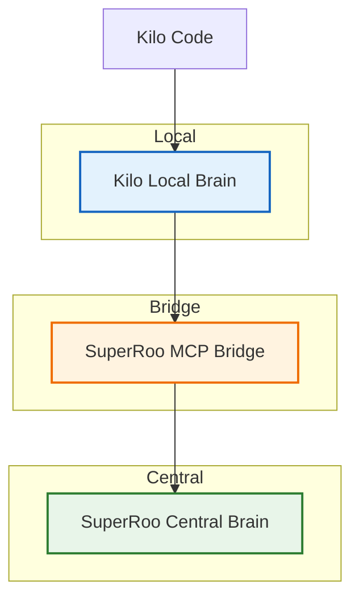

# Architecture Diagram

```mermaid
graph TD
    A[Kilo Code] --> B[Kilo Local Brain]
    B --> C[SuperRoo MCP Bridge]
    C --> D[SuperRoo Central Brain]

    subgraph Local
        B
    end

    subgraph Bridge
        C
    end

    subgraph Central
        D
    end

    style B fill:#e3f2fd,stroke:#1565c0,stroke-width:2px
    style C fill:#fff3e0,stroke:#ef6c00,stroke-width:2px
    style D fill:#e8f5e9,stroke:#2e7d32,stroke-width:2px
```
